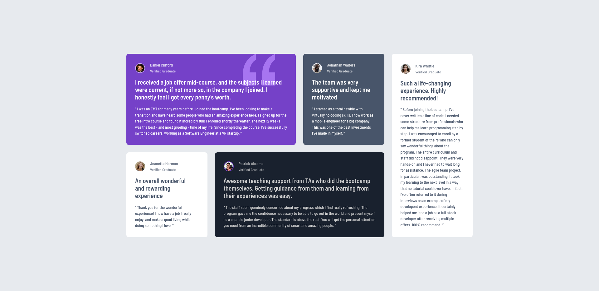

# Frontend Mentor - Testimonials grid section solution

This is a solution to the [Testimonials grid section challenge on Frontend Mentor](https://www.frontendmentor.io/challenges/testimonials-grid-section-Nnw6J7Un7). Frontend Mentor challenges help you improve your coding skills by building realistic projects. 

## Table of contents

- [Overview](#overview)
  - [The challenge](#the-challenge)
  - [Screenshot](#screenshot)
  - [Links](#links)
- [My process](#my-process)
  - [Built with](#built-with)
  - [What I learned](#what-i-learned)
  - [Continued development](#continued-development)
- [Author](#author)

## Overview

### The challenge

Users should be able to:

- View the optimal layout for the site depending on their device's screen size

### Screenshot



### Links

- [Solution URL](https://github.com/Kking927/testimonials-grid-section)
- [Live Site URL](https://kking927.github.io/testimonials-grid-section/)

## My process

### Built with

- Semantic HTML5 markup
- CSS Custom Properties
- Flexbox
- CSS Grid
- Mobile-first workflow

### What I learned

During this project, I improved my ability to implement CSS custom variables. Instead of repeating values, I used variables to coordinate transition timings and easing curves globally. I also implemented a "spotlight" focus effect to improve the user experience. By using parent-level targeting, I created a dynamic interaction where the card you are currently reading "pops" forward while the others subtly dim.

```
:root {
  /* Animation Effects */
  --duration-fast: 0.3s;
  --ease-spring: cubic-bezier(0.34, 1.56, 0.64, 1);

  /* Composite Transitions */
  --transition-pop: var(--duration-fast) var(--ease-spring);
}

/* Applying the Spotlight Focus */
.testimonial-grid:hover .testimonial-card {
  opacity: 0.5;
}

.testimonial-grid .testimonial-card:hover {
  opacity: 1; /* Highlights the active card */
  transform: scale(1.04) translateY(-10px);
  transition: transform var(--transition-pop);
}
```

### Continued development

In future projects, I want to focus on mastering CSS Subgrid. While I successfully implemented a responsive grid for this project, I want to explore how `grid-template-rows: subgrid` can be used to perfectly align internal card elements across sibling cards.

## Author

- Frontend Mentor - [@Kking927](https://www.frontendmentor.io/profile/Kking927)
